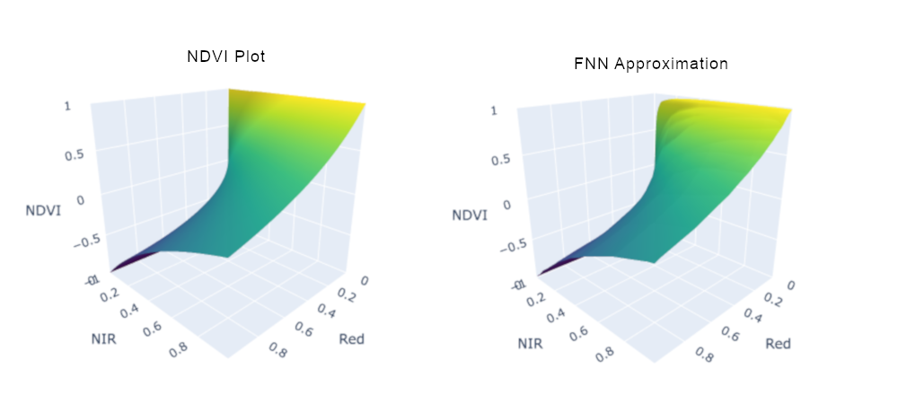
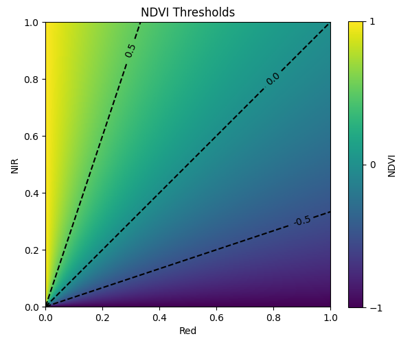
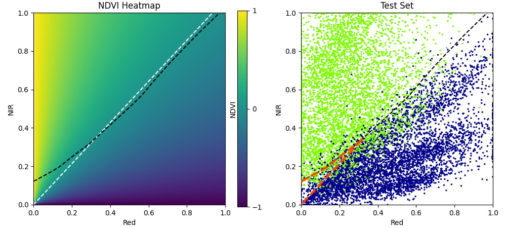
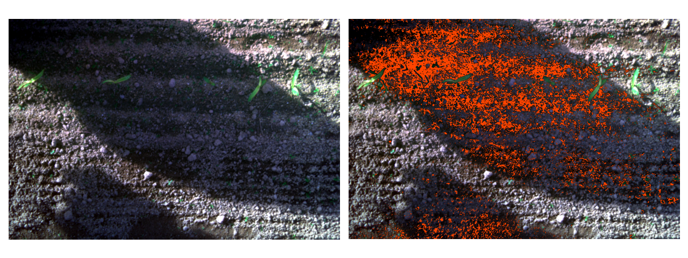
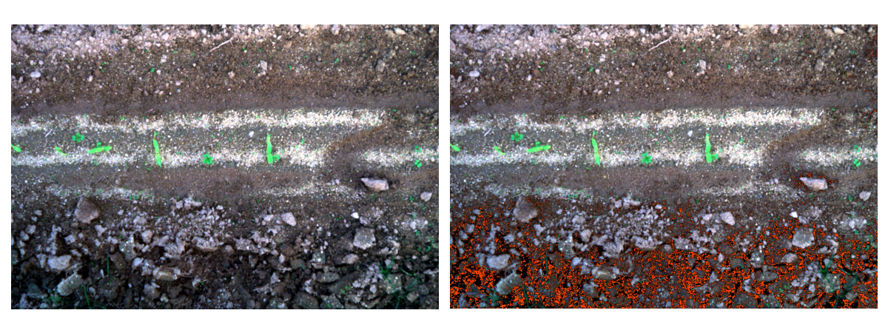
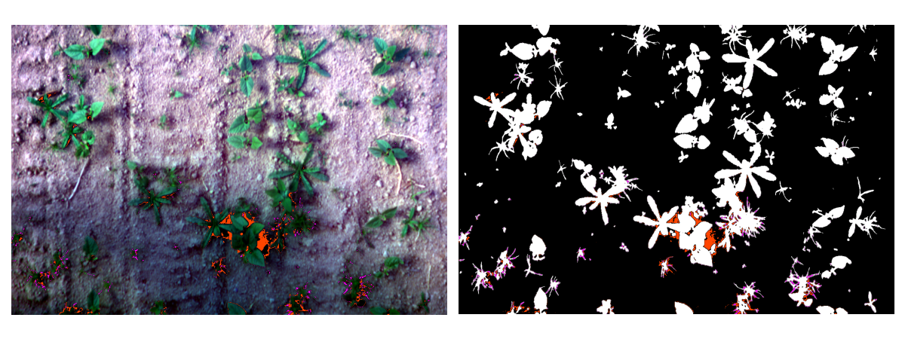
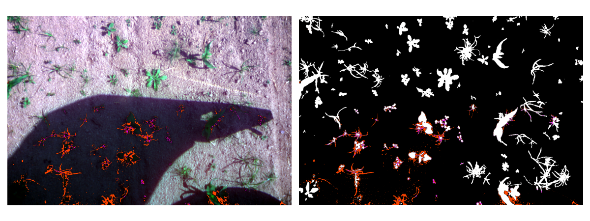
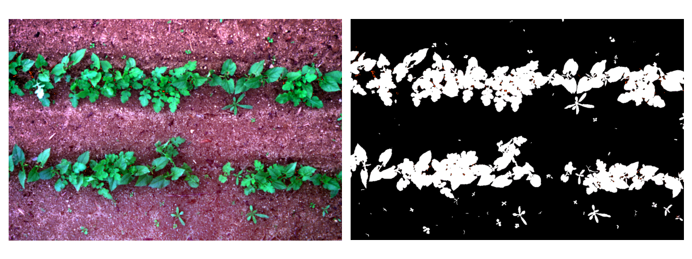
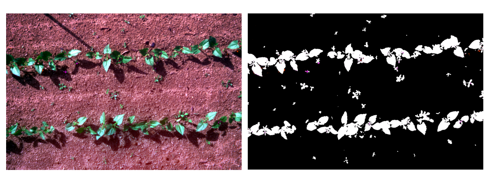

# Machine Learning Vegetation Indices

Vegetation indices are combinations of spectral bands (Blue, Green, Red, Infrared, etc) used in remote sensing to estimate properties of plant life, especially chlorophyll content. They are used to monitor plant health, climate trends, biomass, etc. In machine learning terms, they would be considered *feature representations*, i.e. transformations of raw inputs into more informative representations of those inputs.

One of the most exciting promises of machine learning, and in particular deep learning, is the ability of models to build their own feature representations from data. This is what allows machine learning models to learn very powerful and *context-specific* functions to solve different tasks.

An interesting question therefore is whether machine learning models trained on remote sensing tasks for plant life would learn the same feature representations as human-derived vegetation indices or whether they would differ. And if they differ, does this represent a weakness in the machine learning model, e.g. a spurious data correlation that could lead to poor generalization, or an alternative but viable machine-learned vegetation index (MLVI) that could improve remote sensing performance and/or give new insight into the relationship between frequency response and plant life?

## Purpose of Study and Related Work

Some studies have used machine learning models to optimize or create new vegetation indices, e.g. DeepIndices by Albarracín et al. (2020) and Genetic-Programming-based Vegetation Indices (GPVI) by Vayssade et al. (2021). Although the current research could be used to a similar end, its focus is different. Rather than try to learn an "optimal" vegetation index, it asks the following questions: given the same information as a vegetation index (i.e. the same spectral bands and spatial area) and a remote sensing vegetation task (e.g. plant segmentation), does a machine learning model recreate the relevant vegetation index or learn a new feature representation of its own? If the latter, how can we understand this new representation, its causes and consequences for the task at hand? As such, it is more related to AI interpretation than optimization, though by the nature of machine learning its results could also be used for the latter.

# Pilot Study: Machine Learning NDVI

To give a proof of concept, I conducted a pilot study on machine learning the Normalized Difference Vegetation Index (NDVI), one of the most widely-used vegetation indices. I give a description of the methods and results below, with additional details provided in the [Jupyter notebook](https://github.com/WilliamLockeIV/Machine-Learning-Vegetation-Indices/blob/main/Pilot_Study_NDVI.ipynb), where readers can also reproduce the experiments and adjust their parameters.

NDVI is calculated as the difference between the Near-Infrared (NIR) and Red bands over their sum, as written out below,

$NDVI = \frac{NIR-Red}{NIR+Red}$.

Values range from $-1$ to $+1$, with higher values typically corresponding to healthier vegetation and lower values to stressed or absent vegetation.

I trained a feedforward neural network (FNN) that takes two inputs, a Red value and an NIR value, and calculates a single, task-specific output. It has three hidden layers with 30 neurons per layer, for a total of 91 neurons including output (2911 trainable parameters). I trained it on two tasks, described below.

## Task 1: Learning NDVI via Regression

For the first task, I fed the machine learning model Red and NIR values to see if it could directly predict NDVI values from them. Note that this is not the task proposed in the "Purpose of Study," where the model is supposed to learn the vegetation index indirectly through doing a remote sensing task, but I wanted to see first if it was even possible for the FNN to approximate NDVI. Given that the equation for NDVI is a rational function of Red and NIR, and an FNN can only represent piecewise-affine functions of its inputs (Balestriero & Baraniuk, 2018a,b), it might seem difficult to learn a close approximation. However, as Telgarsky (2017) finds, rational functions and neural networks are actually quite efficient at approximating each other! This means you don't need "too many" neurons in a neural network to approximate a rational function and vice-versa (specifically, each can approximate the other to $\epsilon$-precision with $O(poly \; log(1/\epsilon))$ degree or size). And indeed, at least to visual inspection, the FNN reproduces the NDVI function over all possible values of Red and NIR reasonably well.

## Task 2: Learning NDVI Thresholds via Classification

For the second task, I trained the machine learning model on actual images of plants with dirt / soil backgrounds. More specifically, I fed it specific pixels with only Red and NIR values and asked it to classify the pixel as plant or background. Carried out over all pixels in an image, this task is called "semantic segmentation" in machine learning literature.

The purpose was to see if the FNN would learn something equivalent to an NDVI threshold to classify pixels as either plant or background. Given NDVI's higher values corresponding to healthy plant life and lower values for barren ground, a naive approach to this task would be to simply set a threshold in NDVI and classify any pixels above that threshold as plant life and any pixels below it as background. (I note here that I haven't actually seen this approach used in the literature, and I'm sure there are more effective methods to carry out this task; however, as the following experiments show, it isn't an unreasonable baseline!) If the FNN were to reproduce an NDVI threshold, it would clearly show that it had learned a feature representation, not necessarily of the whole range of NDVI, but of whether a given pixel was above or below that NDVI threshold; and if it learned a threshold separate from a fixed value of NDVI, it would be interesting to see where those thresholds differed and why.

It turns out that, while calculating NDVI is a rational function of the Red and NIR bands, calculating all possible Red and NIR values for a fixed threshold of NDVI is a linear function!$^{a}$ Specifically, for a fixed NDVI threshold $t$, you can calculate

$NIR = \frac{1+t}{1-t}Red \; \; \;$ or $\; \; \; Red = \frac{1-t}{1+t}NIR$.

$^{a}$ (This is obvious from the structure of the rational equation, I just hadn't thought of it before graphing out the function.)

A linear function should be easy for a neural network to learn, so there's no question of the FNN having the capacity to learn this function; it would come down to whether this was the most effective way of segmenting the data. To train the model, I selected 80,000 pixels from 80 images (40,000 vegetation, 40,000 background), and I set aside 11,000 pixels from a separate set of 11 images (5,500 vegetation, 5,500 background) for evaluation. To find the most effective NDVI threshold for classification, I did a grid search from $-1$ to $+1$ for the value that would maximize F1 score on the 80,000 training pixels, and then also evaluated that threshold on the 11,000 test pixels. The resulting threshold was set at NDVI $\approx 0.03$ and produced a Test F1 score of 0.93.

Meanwhile, the FNN learned the following classification threshold.

Below we compare them.

As can be seen, across most of the input space the machine learned threshold stays fairly close to the NDVI threshold. However, it is not a linear function of either Red or NIR, and it diverges most significantly from the linear threshold in the bottom-left corner, where both Red and NIR values are close to zero. Pixels in this range it classifies as background, while the NDVI threshold would classify them as vegetation. Interestingly, on the test set, the FNN threshold also produces an F1 score of 0.93, so on this particular dataset it doesn't improve that evaluation metric! (We look more closely at this and other metrics in the Jupyter notebook.) To understand why it makes this deviation then, we need to look at some actual images.

The first image we'll look at is taken from the Train dataset. All pixels in that bottom-left corner of the NDVI heatmap, where the NDVI threshold would classify them as plants while the FNN threshold would classify them as background, are colored in either orange or magenta -- orange if the FNN threshold is correct and they are actually background, magenta if the NDVI threshold is correct and they are actually plant life.

In this image, the FNN model is obviously correct for almost all pixels where the two thresholds diverge. This is an extreme case, and we will see images later where the two classes are more balanced, but in general the FNN model will have more correct predictions simply because there is more background than plant life (remember, we trained and evaluated both thresholds on a balanced dataset of plant and background pixels, but in actual photos we will generally have far more background pixels than plants, at least in this dataset).

More interesting, almost all the highlighted pixels are in the shaded regions of the image. This gives us a very good indication of what that bottom-left corner of the NDVI heatmap corresponds to--shadows, where both Red and NIR reflectance is low. In these shadowed regions, the NDVI threshold obviously over-predicts plant life, as indicated by the divergence between its predictions and the (in this case correct) FNN predictions. We'll see a similar example in the next image.

This image is also taken from the Train dataset, and in this case actually all divergent predictions are background pixels (misclassified as plant life by the NDVI threshold). I include it along with the above image because it isn't clear to me whether the misclassified pixels are darker because of shadow, or if they represent darker soil dug up by the apparent disturbance of the ground along the bottom of the image (or both). It's one of the few images in either dataset where differences in threshold predictions aren't obviously limited to shaded regions.$^{b}$

$^{b}$ (I should clarify here that there are other differing predictions between the two thresholds, however we are only highlighting pixels in the bottom-left corner of the NDVI heatmap, since this is where the two thresholds most clearly diverge.)

Now we come to an image where the two thresholds again diverge in their predictions on the shaded regions, but in this case some of those divergent pixels are in fact plant life (misclassified by the FNN threshold as background). The right hand image shows the ground truth segmentation (background in black, vegetation in white), where it is easier to see the magenta pixels corresponding to plant life, correctly identified by the NDVI threshold but misidentified by the FNN threshold. This image is taken from the Test dataset, which by chance seems to have more images than the Train dataset where shadowed plant life falls within that bottom-left corner of the NDVI heatmap, which might explain why the FNN does not perform as well on the Test dataset (equal to the NDVI threshold in terms of F1).

This is another image from the Test dataset, where again some of the shaded pixels indicating disagreement are plant life and some are background. In this case, I would draw attention to some of the orange pixels near the bottom-left, which are annotated (by humans) as background, but based on the shapes they form look like they might be leaves of grass (visible in other parts of the image). It's possible that these were actually mis-annotated and should be plant life, as would be predicted by the NDVI threshold, though it's very hard to tell.

The next is one of several images of sunny, evenly-lit fields, where both thresholds have almost perfect agreement (at least in the region of pixel-space we're looking at). This reinforces our earlier interpretation that the bottom-left corner of the heatmap, where the two thresholds diverge most sharply, represents areas of shadow.

However, this final image does have some shadows cast by the plants themselves, with little to no difference in predictions. Why these shadowed pixels don't fall into that divergent region between thresholds isn't immediately clear, and suggests that there are additional factors affecting Red and NIR reflectance even in shadow.

## Discussion and Further Study

# References
Albarracín, J.F.H., Oliveira, R.S., Hirota, M., dos Santos, J.A., & Torres, R.S. A Soft Computing Approach for Selecting and Combining Spectral Bands. Remote Sensing, 2020.

Balestriero, R., & Baraniuk, R. A Spline Theory of Deep Networks. In Proc. ICML, 2018a.

Balestriero, R., & Baraniuk, R. Mad Max: Affine Spline Insights into Deep Learning. arXiv preprint, arXiv:1805.06576v5, 2018b.

Telgarsky, M. Neural networks and rational functions. In Proc. ICML, 2017.

Vayssade, J.-A., Paoli, J.-N., Gée, C., & Jones, G. DeepIndices: Remote Sensing Indices Based on Approximation of Functions through Deep-Learning, Application to Uncalibrated Vegetation Images. Remote Sensing, 2021.

[Dataset] Vayssade, J.-A., Jones, G., Paoli, J.-N., & Gée, C. Dataset used in DeepIndices. Recherche Data Gouv, V2, 2021. https://doi.org/10.15454/DSQC8N